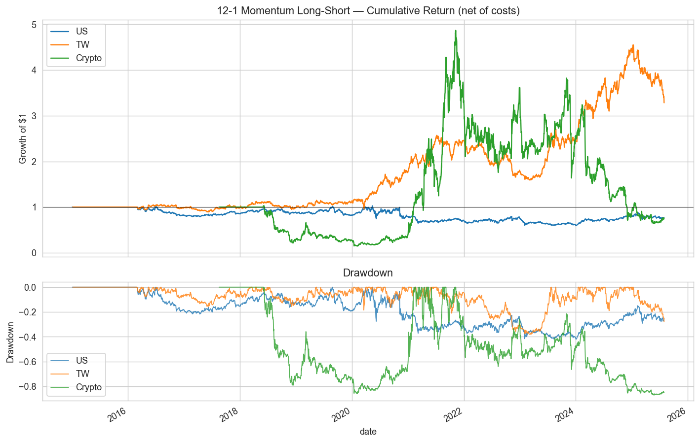
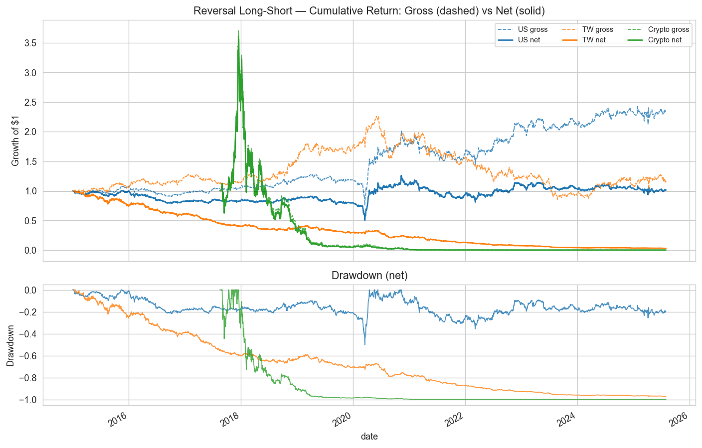
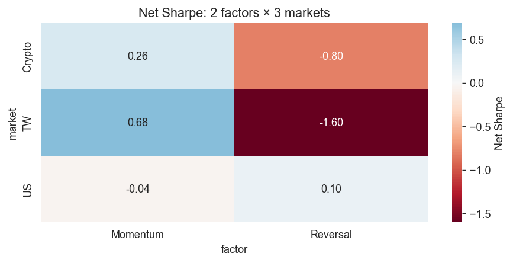

# classic-factors

> **Languages**: **English** · [繁體中文](docs/README.zh-TW.md)

I ran the two most canonical equity factor strategies — 12-1 momentum and 1-week reversal — through the same pipeline across three markets: US S&P 500, Taiwan 0050, and the top 25 liquid USDT pairs. The question I cared about wasn't whether these factors show up in academic papers; it was whether any of it survives into net returns once you account for what it actually costs to execute in each market.

Research framework: [`qtools`](https://github.com/matthiola0/qtools).

## Headline result

Net Sharpe across 2 factors × 3 markets, after realistic per-market costs:

| | Momentum (monthly) | Reversal (weekly) |
|---|---:|---:|
| US (S&P 500) | −0.04 | +0.10 |
| TW (0050) | **+0.68** | −1.60 |
| Crypto (top 25) | +0.26 | −0.80 |

Of six cells, only one — **TW momentum** — is actually tradeable after costs. US large-cap momentum has decayed to noise post-2015. The strongest *gross* signal in the matrix is TW reversal, but the 0.3% securities transaction tax compounded weekly turns it into the worst *net* Sharpe (~35%/yr cost drag). Crypto reversal loses in every regime; crypto momentum is regime-dependent and not standalone alpha.

## Research question

The real question is whether the same signal behaves differently depending on where you trade it. The cost structure between Taiwan equities, US large caps, and crypto is different enough that I expected the answer to vary a lot — and it did, more than the gross IC numbers alone would suggest.

## Scope

| Factor | Definition | Rebalance |
|---|---|---|
| 12-1 Momentum | 12-month return excluding the most recent month | Monthly |
| 1-week Reversal | Negative of past-week return | Weekly |

| Market | Universe | Period | Cost model |
|---|---|---|---|
| US | 502 current S&P 500 constituents | 2015-01 → 2025-07 | 5 bps per leg |
| TW | 50 current 0050 constituents | 2015-01 → 2025-07 | 46 bps round-trip (3 bps commission + 5 bps slippage per leg + 30 bps tax on sells) |
| BTC | 25 top USDT pairs by volume | 2017-08 → 2025-07 | 10 bps per leg |

## Limitations

I'm using current index constituents throughout, so delisted or ejected names are invisible — survivorship bias is real and I'm not correcting for it. All factors are restricted to what's computable from OHLCV data; fundamentals (P/B, P/E) are out of scope since qtools has no fundamentals loader. The cost model is flat bps per leg with no market-impact or per-security variation. For crypto, I request the top 30 USDT pairs but only 25 have full history back to 2017 — the results are on those 25.

## Results

### 12-1 Momentum ([notebook 01](notebooks/01_momentum.ipynb))

| Market | IC mean | IC IR | LS Sharpe (net) | Ann return | MDD |
|---|---|---|---|---|---|
| US (S&P 500) | −0.002 | −0.01 | −0.04 | −2.5% | −42% |
| **TW (0050)** | **+0.046** | **+0.18** | **+0.68** | **+12.4%** | −38% |
| Crypto (top 25) | +0.004 | +0.01 | +0.26 | −2.6% | −87% |

US large-cap momentum has essentially decayed to noise since 2015 — IC −0.002, barely distinguishable from random. This matches what McLean & Pontiff (2016) documented on factor crowding; I wasn't surprised. Taiwan is different: IC +0.046, net Sharpe 0.68, with 2020's COVID rebound being the standout year at +1.96. My read is that higher retail participation and thinner institutional coverage means the mechanism hasn't been arbitraged away yet. Crypto momentum is regime-dependent in a specific way: it worked during the 2021–22 bear (+1.39 Sharpe, shorts contributing) and reversed during 2023–25 (−0.57). Without a regime filter it isn't standalone alpha.



### 1-Week Reversal ([notebook 02](notebooks/02_reversal.ipynb))

| Market | IC mean | Gross Sharpe | Net Sharpe | Cost drag/yr |
|---|---|---|---|---|
| US (S&P 500) | +0.014 | +0.56 | +0.10 | ~8% |
| TW (0050) | +0.027 | +0.17 | **−1.60** | ~35% |
| Crypto (top 25) | −0.013 | −0.67 | −0.80 | ~15% |

US reversal has real gross alpha (+0.56 Sharpe) that costs eat almost entirely (net +0.10). The signal exists; it's just not retail-tradeable. Taiwan's case is more extreme: reversal has the strongest gross IC in the entire 6-cell matrix, but the 0.3% securities transaction tax compounds weekly — about 52 times per year — producing a ~35%/yr cost drag that turns it into a −1.60 net Sharpe disaster. The strongest-IC cell is also the least tradeable. Crypto is simply a momentum market at the weekly horizon; reversal IC is negative in every regime.



### Cross-factor × cross-market ([notebook 99](notebooks/99_summary.ipynb))

Net Sharpe matrix (2 factors × 3 markets):

| | Momentum (monthly) | Reversal (weekly) |
|---|---|---|
| US | −0.04 | +0.10 |
| TW | **+0.68** | −1.60 |
| Crypto | +0.26 | −0.80 |



Within each market, momentum and reversal are near-uncorrelated (|ρ| < 0.1) — they capture genuinely different horizons. But that independence doesn't make a 50/50 combined portfolio attractive: when one leg is deeply negative, averaging it in just drags down the winner. Out of six cells, only one is actually tradeable after costs: TW momentum.

## Layout

```
classic-factors/
├── src/factors/signals.py        # Factor signal functions
├── scripts/
│   └── download_data.py          # Populate qtools cache
├── notebooks/
│   ├── 01_momentum.ipynb
│   ├── 02_reversal.ipynb
│   └── 99_summary.ipynb
└── reports/figures/              # Generated on notebook execution
```

## Notebook tour

- [`01_momentum.ipynb`](notebooks/01_momentum.ipynb) — 12-1 momentum across all three markets, side-by-side IC + gross/net Sharpe + per-year breakdown + cumulative-net-return chart. The TW Sharpe 0.68 vs US −0.04 contrast lives here.
- [`02_reversal.ipynb`](notebooks/02_reversal.ipynb) — 1-week reversal across the same three markets. Punchline figure is gross-vs-net Sharpe by market, which makes the 35%/yr Taiwan cost drag visible at a glance.
- [`99_summary.ipynb`](notebooks/99_summary.ipynb) — cross-factor × cross-market Sharpe heatmap, momentum-vs-reversal correlation panel, and a 50/50 combined-portfolio sanity check that motivates the "only TW momentum survives" conclusion.

## Reproducing

```bash
# Clone and install (qtools is pulled in automatically via pyproject.toml)
git clone https://github.com/matthiola0/classic-factors
cd classic-factors
pip install -e .

# Populate price cache (~60 MB, ~45s on first run)
python scripts/download_data.py

# Re-execute notebooks
jupyter nbconvert --to notebook --execute notebooks/*.ipynb --inplace
```

**Local development.** If you also have a local clone of
[`qtools`](https://github.com/matthiola0/qtools) and want edits to
propagate without pushing, run `pip install -e ../qtools` after the step above
to override the git-installed copy with the editable local one.

## References

The study follows the canonical formulations in:

**Momentum**
- Jegadeesh, N., & Titman, S. (1993). Returns to buying winners and selling losers:
  Implications for stock market efficiency. *Journal of Finance*, 48(1), 65–91.
  [doi:10.1111/j.1540-6261.1993.tb04702.x](https://doi.org/10.1111/j.1540-6261.1993.tb04702.x)
- Asness, C. S., Moskowitz, T. J., & Pedersen, L. H. (2013). Value and momentum
  everywhere. *Journal of Finance*, 68(3), 929–985.
  [doi:10.1111/jofi.12021](https://doi.org/10.1111/jofi.12021)

**Short-term reversal**
- Jegadeesh, N. (1990). Evidence of predictable behavior of security returns.
  *Journal of Finance*, 45(3), 881–898.
  [doi:10.1111/j.1540-6261.1990.tb05110.x](https://doi.org/10.1111/j.1540-6261.1990.tb05110.x)
- Nagel, S. (2012). Evaporating liquidity. *Review of Financial Studies*, 25(7),
  2005–2039. [doi:10.1093/rfs/hhs066](https://doi.org/10.1093/rfs/hhs066)
  — interprets short-term reversal profits as compensation for liquidity provision,
  directly relevant to my finding that the US gross signal is eaten by realistic costs.

**Factor decay & cost-adjusted returns**
- Novy-Marx, R., & Velikov, M. (2016). A taxonomy of anomalies and their trading
  costs. *Review of Financial Studies*, 29(1), 104–147.
  [doi:10.1093/rfs/hhv063](https://doi.org/10.1093/rfs/hhv063)
- McLean, R. D., & Pontiff, J. (2016). Does academic research destroy stock return
  predictability? *Journal of Finance*, 71(1), 5–32.
  [doi:10.1111/jofi.12365](https://doi.org/10.1111/jofi.12365)
